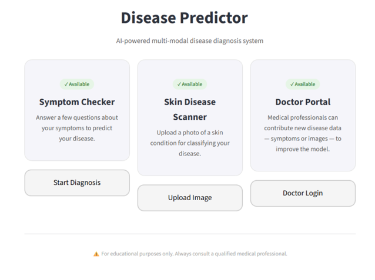
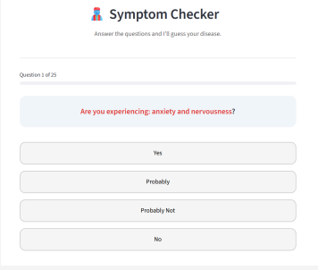
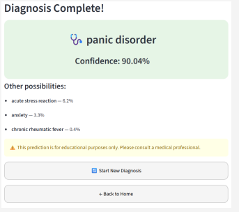
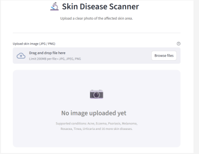
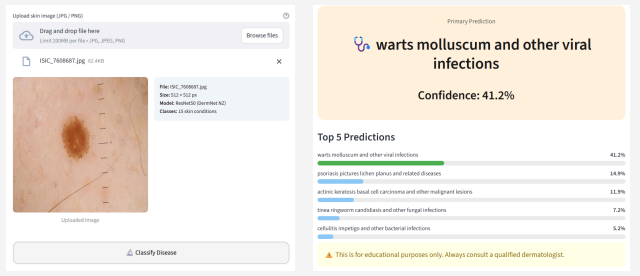
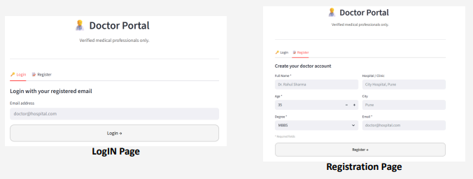
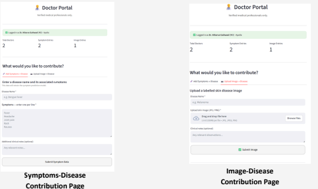

# 🧠 Multi-Modal Disease Diagnosis System

An AI-powered web application that predicts diseases using **symptoms** and **skin images**, and continuously improves through a **doctor contribution system**.

---

## 🚀 Overview

This project presents a multi-modal disease diagnosis platform that integrates:

- Symptom-based disease prediction
- Image-based skin disease classification
- Doctor-driven data contribution system

The system is deployed using **Streamlit**, enabling real-time interaction and fast diagnosis support.

---

## 🧩 Key Features

### 🟢 1. Symptom-Based Diagnosis
- Predicts diseases based on user-input symptoms
- Uses an **ensemble model (Naive Bayes, Logistic Regression, KNN)**
- Dynamic questioning improves prediction accuracy
- Provides:
  - Primary disease prediction
  - Alternative possible diseases
  - Confidence score

---

### 🔵 2. Image-Based Diagnosis
- Classifies skin diseases using uploaded images
- Built using **CNN with Transfer Learning**
- Handles real-world variability using preprocessing and augmentation
- Outputs:
  - Top predicted diseases
  - Confidence scores

---

### 🟣 3. Doctor Portal (Continuous Learning System)
- Secure doctor login & registration
- Doctors can:
  - Add new disease-symptom mappings
  - Upload labeled medical images
- Data stored in **Aiven MySQL Cloud Database**
- Enables **batch retraining** to improve model performance over time

---

## 🏗️ System Architecture

1. User inputs symptoms or uploads image  
2. Data preprocessing (vectorization / normalization)  
3. Model prediction (ML / CNN)  
4. Results displayed with confidence  

📌 Refer to system architecture diagram in presentation :contentReference[oaicite:0]{index=0} (Page 8)

---

## 📊 Datasets Used

### 🔹 Symptom Dataset
- ~2.4 lakh records
- ~370+ symptoms
- ~700+ diseases
- Each record maps symptoms → disease

### 🔹 Image Dataset
- 20 Skin Diseases Dataset (Kaggle)
- Filtered to remove noisy/low-sample classes
- Balanced using data augmentation

---

## ⚙️ Methodology

- Data Cleaning & Preprocessing
- Feature Engineering (symptom vectorization)
- Image normalization & resizing
- Model training:
  - Ensemble ML (symptoms)
  - CNN (images)
- Deployment using Streamlit

📌 Detailed pipeline shown in PPT :contentReference[oaicite:1]{index=1} (Page 7)

---

## 📈 Results

- Symptom Prediction Accuracy: **~91%**
- Image Classification Accuracy: **~82%**
- Fast response time: **< 2 seconds**

✔ Improved performance after dataset balancing  
✔ Reliable for common disease prediction  

📌 Output samples available in PPT :contentReference[oaicite:2]{index=2} (Pages 19–21)

---

## 🛠️ Tech Stack

- **Frontend:** Streamlit  
- **Backend:** Python  
- **ML Models:** Scikit-learn, TensorFlow/Keras  
- **Database:** Aiven MySQL (Cloud)  
- **Libraries:** Pandas, NumPy, OpenCV, PIL  

---

## 📂 Project Structure
Disease-Akinator/
│
├── app.py
├── final_ensemble.pkl
├── skin_model.h5
├── class_names.pkl
├── feature_names.pkl
├── imputer.pkl
├── requirements.txt
└── assets/

---

---

## 📸 Application Screenshots

### 🔹 Home Page

### 🔹 Symptom-Based Diagnosis

### 🔹 Image-Based Diagnosis

### 🔹 Doctor Portal

---

## 🔄 Continuous Learning

Doctor Input → MySQL Database → Retraining → Model Update → Improved Predictions  

---

## 🌍 Use Cases

- Preliminary health diagnosis  
- Remote healthcare assistance  
- AI-based decision support  
- Medical data collection  

---

## ⚠️ Disclaimer

This system is for **educational purposes only** and should not replace professional medical advice.

---

## 🔮 Future Scope

- Mobile app development  
- Hospital system integration  
- Real-time monitoring using wearables  
- Expansion to more diseases  
- Automated retraining pipeline  

---

## 👨‍💻 Authors

- Atharva Gaikwad  

---

